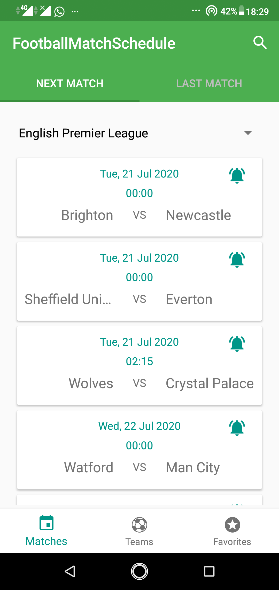
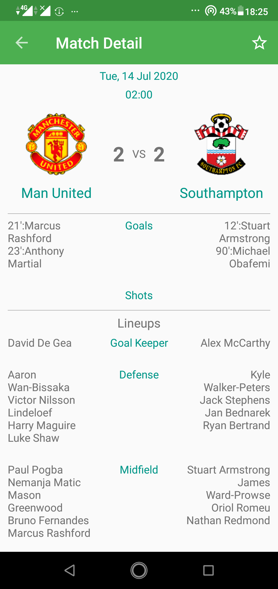
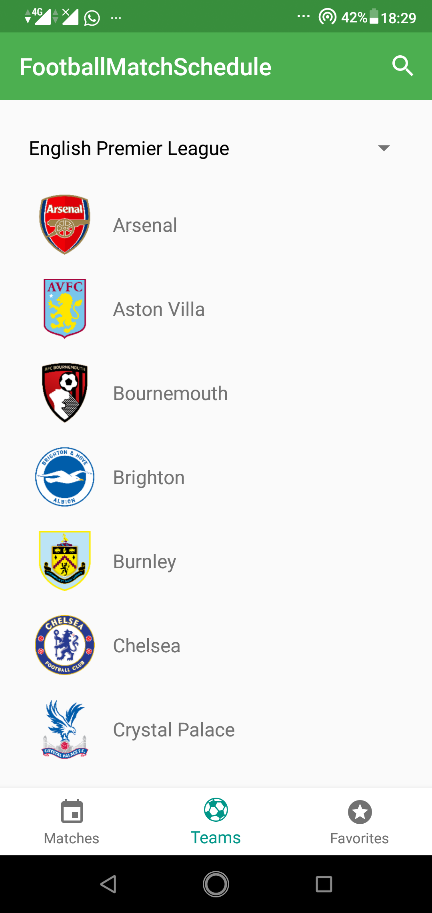
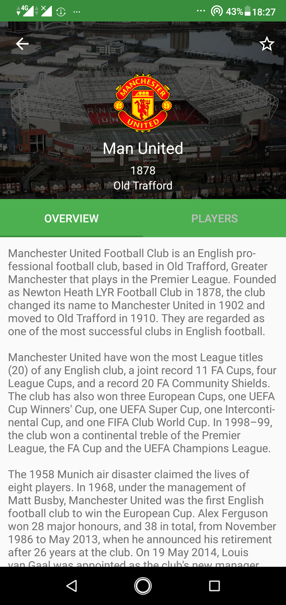
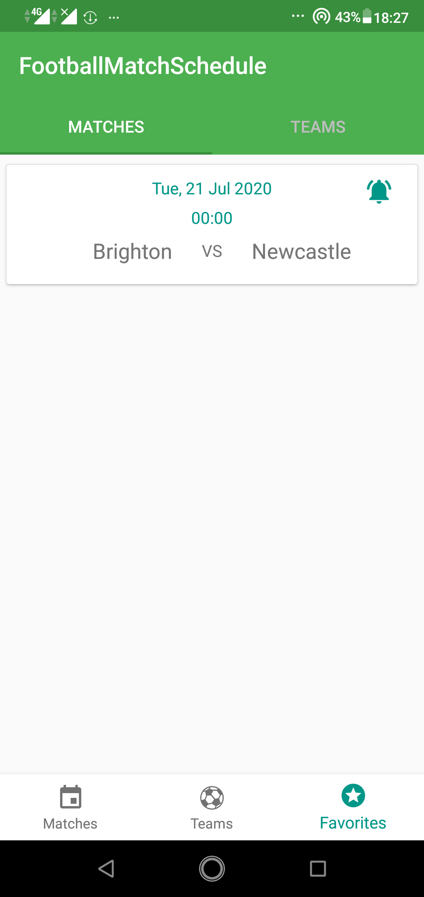
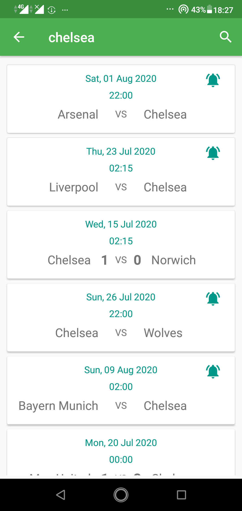

<h1 align="center">
Football Match Schedule
</h1>
This is my submission progress at Dicoding online course at class Kotlin Android Developer Expert (KADE) https://www.dicoding.com/academies/55 . I've enrolled in this class as part of Google Developer Kejar Batch 2 (2018).

## Screenshots

  
  
  
  
  
  

## Features

1. Next Match.
2. Last Match.
3. Detail next match and last match.
4. Add to google calendar for next match.
5. List Team.
6. Detail Team.
7. Favorite match and team.

## Tech Stack
- [x] Kotlin
- [x] SQLite
- [x] Retrofit

API from: <a href="https://www.thesportsdb.com/" title="TheSportsDB">TheSportsDB</a>

## Apps
<a href="https://drive.google.com/file/d/1teSvXQM9Eo_RmQ2Mud0SGQ65DcGUqE7t/view?usp=sharing" title="Football Match Schedule Apps">Download Here</a>

## Author
* **Alvin Tandiardi**
